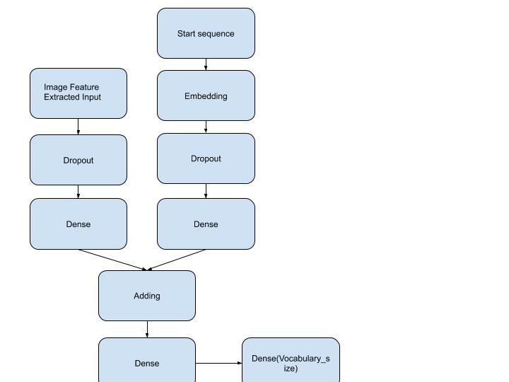
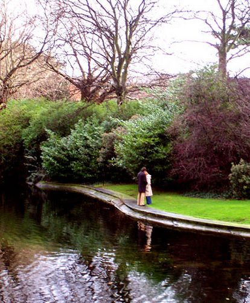

# Image-Captioning

## Objective

Given an image, write a description describing the scene

## Dataset

Flickr8k Dataset:

The dataset consists of 8000 images with which 5 captions are associated. Captions are short sentences describing salient entities and events in the image. The images does not contain any well-known person or location but carefully chosen to have multiple types of situations and scenes.

## Model Pipeline

1. Images Feature Extractor: We used pretrained VGG16 model to extract intermediate representation from 2nd last dense layer. We extract features for each image and store it in a file called features.pkl. The feature for each image extracted is of size (4096x1).

2. Word Embedding Generator: We have a trainable word embedding layer and then a LSTM/GRU/BiLSTM layer for processing sequences.

3. Final Model: We take inputs from image feature extractor and word embedding generator and add them. The output of the previous action is then fed to a dense layer of vocabulary size.  

## Results and Observations

| __Models__   | __BLEU-1__ | __BLEU-2__ | __BLEU-3__ | __BLEU-4__ |
|------------- |------------|------------|------------|------------|
| LSTM         | 0.5534     | 0.2947     | 0.1997  | 0.0894        |
| GRU          | 0.5509     | 0.2969     | 0.2008  | 0.0902        |
| BiLSTM       | __0.5597     | 0.3031     | 0.2093  | 0.0968__    |

LSTM: A man in red shirt is standing on the beach

GRU : A man in red shirt is running down the street

BiLSTM: A man in red shirt is standing on the beach

## Requirements

numpy==1.16

keras==2.2.0

pickle==4.0

nltk==3.3

## Instructions

## References

@article{,
title= {Flickr8k Dataset},
keywords= {},
author= {},
abstract= {8,000 photos and up to 5 captions for each photo.

Hodosh, Micah, Peter Young, and Julia Hockenmaier. "Framing image description as a ranking task: Data, models and evaluation metrics." Journal of Artificial Intelligence Research 47 (2013): 853-899.

https://machinelearningmastery.com/develop-a-deep-learning-caption-generation-model-in-python/

